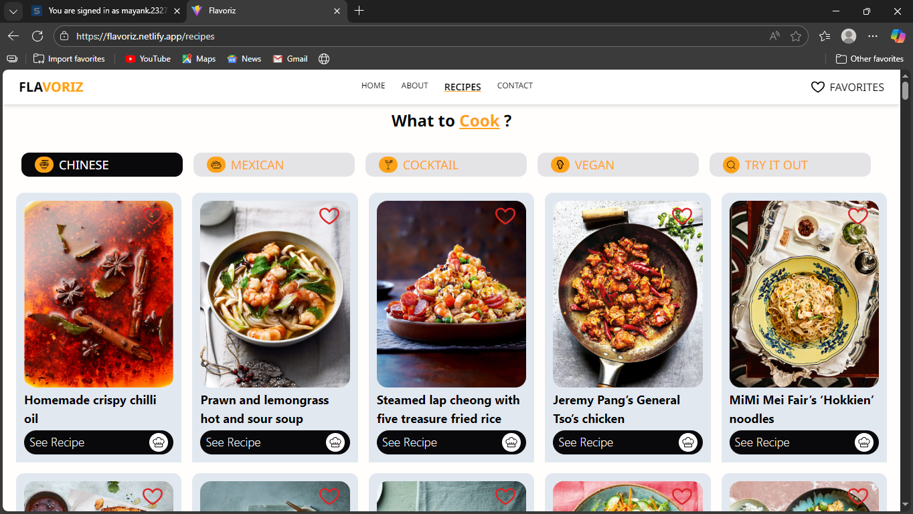

# 🍲 Recipe Book App

A full-stack web application that allows users to create, view, update, and manage recipes through a clean and responsive interface.

This project was built **from scratch** to practice real-world full-stack development using modern web technologies.

---

## 🚀 Live Demo
🔗 https://flavoriz.netlify.app/

---

## 🧠 Problem Statement
Managing personal recipes digitally should be simple, fast, and user-friendly.  
This project solves that by providing an intuitive platform where users can easily add, browse, edit, and delete recipes.

---

## ✨ Features
- Add new recipes with details  
- View all recipes in a structured layout  
- Edit existing recipes  
- Delete recipes  
- Responsive UI for different screen sizes  
- RESTful API integration between frontend and backend  

> Authentication is intentionally not included at this stage to keep the focus on core CRUD functionality.

---

## 🛠 Tech Stack

**Frontend**
- React
- JavaScript (ES6+)
- HTML5, CSS3
- Tailwind CSS

**Backend**
- Node.js
- Express.js

**Database**
- MongoDB

---

## ⚙️ How It Works
- Frontend communicates with backend using REST APIs  
- Backend handles CRUD operations  
- MongoDB stores recipe data  
- React handles UI rendering and state management  

---

## 📸 Screenshots
_Add screenshots here_

```md
![Home Page]


